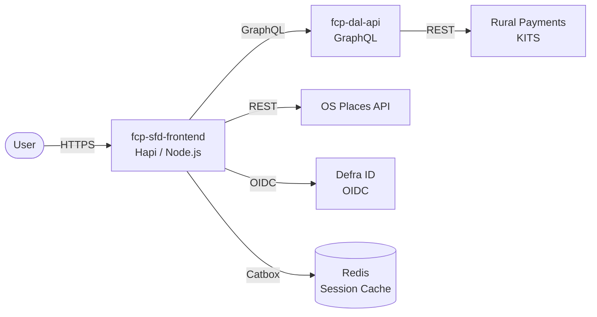

# fcp-sfd-frontend

[](https://sonarcloud.io/summary/new_code?id=DEFRA_fcp-sfd-frontend)
[](https://sonarcloud.io/summary/new_code?id=DEFRA_fcp-sfd-frontend)
[](https://sonarcloud.io/summary/new_code?id=DEFRA_fcp-sfd-frontend)

Frontend service for the Single Front Door (SFD) on the Future Farming and Countryside Programme (FCP). It provides a GOV.UK-styled interface for farmers and land managers to view and manage their business and personal details.

The service retrieves and updates data through the [Data Access Layer (DAL)](https://github.com/DEFRA/fcp-dal-api) via GraphQL, which acts as a unified gateway to Rural Payments (KITS) upstream services. Address lookups are performed against the [OS Places API](https://osdatahub.os.uk/) using postcode search, allowing users to find and select addresses when updating their business or personal details. Users authenticate via Defra ID using OpenID Connect (OIDC).

### How the service communicates



## Prerequisites

- Docker
- Docker Compose
- Node.js (v22 LTS)

## Setup

Clone the repository and install dependencies:
```
git clone https://github.com/DEFRA/fcp-sfd-frontend.git
cd fcp-sfd-frontend
npm install
```

## Configuration

Check out [.env.example](/.env.example) for details of the required things you'll need in your `.env` file. Contact the SFD dev team if you are unsure of the values you need to use.

## Running the application

You can either run this service independently or alternatively run the [fcp-sfd-core](https://github.com/DEFRA/fcp-sfd-core) repository for local development if you need to run more services simultaneously.

### Building the Docker image

Container images are built using Docker Compose. It's important to note that in order to successfully run the [fcp-dal-api](https://github.com/defra/fcp-dal-api) and its [upstream-mock](https://github.com/defra/fcp-dal-upstream-mock) to interact with the Data Access Layer (DAL), you _must_ run this service as a Docker container. This is because the [Docker Compose configuration](./compose.yaml) for this repository pulls and runs the Docker images for the `fcp-dal-api` and `fcp-dal-upstream-mock` (a.k.a. the DAL or KITS mock) from the Docker registry.

First, build the Docker image:
```
docker compose build
```

### Starting the Docker container

The recommended way to start the stack is via the **⬆️ Up Frontend** VS Code task (provided by [`fcp-sfd-dev-environment`](https://github.com/DEFRA/fcp-sfd-dev-environment)), or by running:
```
docker compose up
```
This starts `fcp-sfd-frontend`, `fcp-dal-api`, `fcp-dal-upstream-mock`, Redis, and MongoDB. By default it connects to the **real Defra ID** — you'll need valid `DEFRA_ID_*` credentials in your `.env`.

Use the `-d` flag to run in detached mode e.g. if you wish to view logs in another application such as Docker Desktop.

You can find further information on how SFD integrates with the DAL on [Confluence](https://eaflood.atlassian.net/wiki/spaces/SFD/pages/5712838853/Single+Front+Door+Integration+with+Data+Access+Layer).

### Using the Defra ID stub

If you don't have real Defra ID credentials, or want a faster sign-in loop during development, use the **🥸🧪 Run with stubs (DefraID + published DAL mock)** VS Code task. This starts the full stack with an in-built Defra ID stub instead of the real Defra ID service. The stub is configured via [`defra-id.data.json`](./defra-id.data.json).

You can also toggle the stub on/off on an already-running stack using the **🥸 DefraID: Enable stub** and **🤡 DefraID: Disable stub** VS Code tasks.

### Running with a local upstream mock

If you need to modify mock responses or the upstream deployed environments are unavailable, you can build `fcp-dal-upstream-mock` from a local checkout instead of using the published Docker image.

1. Clone the upstream mock repository:
   ```
   git clone https://github.com/DEFRA/fcp-dal-upstream-mock.git
   ```
2. Add the path to your `.env` file:
   ```
   DAL_UPSTREAM_MOCK_LOCAL_PATH=/path/to/fcp-dal-upstream-mock
   ```
3. Start the stack using the local mock:
   ```
   npm run docker:dal-local
   ```

> **Note:** a VS Code task for this is provided by [`fcp-sfd-dev-environment`](https://github.com/DEFRA/fcp-sfd-dev-environment) — see the **🥸🧪🔧 Run with stubs (DefraID + local DAL mock)** task.

### Accessing the application

The application will be available at http://localhost:3000.

## Features

### Business Selection
Users with multiple business enrollments can switch between businesses by clicking the "Choose another business" link in the top left of the home page. This triggers re-authentication with Defra ID to allow selecting a different business/organisation.

## Tests

### Running tests

Run the tests with:

```
npm run docker:test
```
Or to run the tests in watch mode:
```
npm run docker:test:watch
```

## Server-side Caching

We use Catbox for server-side caching. By default, the service will use CatboxRedis when deployed and CatboxMemory for local development. You can override the default behavior by setting the `SESSION_CACHE_ENGINE` environment variable to either `redis` or `memory`.

Please note: CatboxMemory (`memory`) is _not_ suitable for production use! The cache will not be shared between each instance of the service and it will not persist between restarts.

## Licence

THIS INFORMATION IS LICENSED UNDER THE CONDITIONS OF THE OPEN GOVERNMENT LICENCE found at:

<http://www.nationalarchives.gov.uk/doc/open-government-licence/version/3>

The following attribution statement MUST be cited in your products and applications when using this information.

> Contains public sector information licensed under the Open Government license v3

### About the licence

The Open Government Licence (OGL) was developed by the Controller of His Majesty's Stationery Office (HMSO) to enable information providers in the public sector to license the use and re-use of their information under a common open licence.

It is designed to encourage use and re-use of information freely and flexibly, with only a few conditions.
